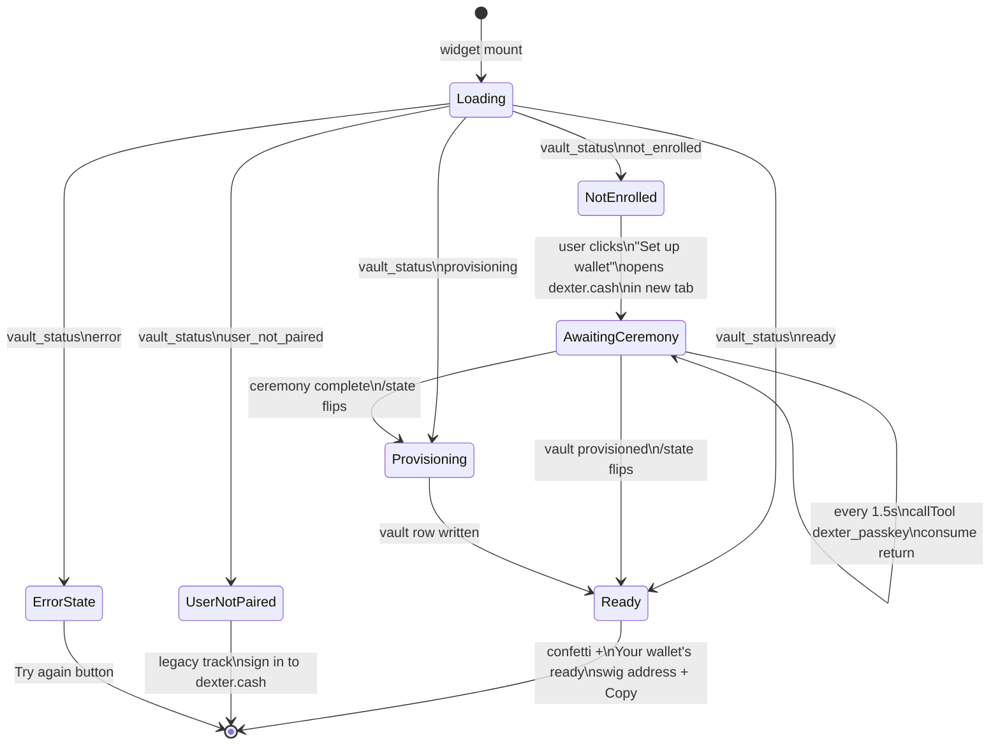
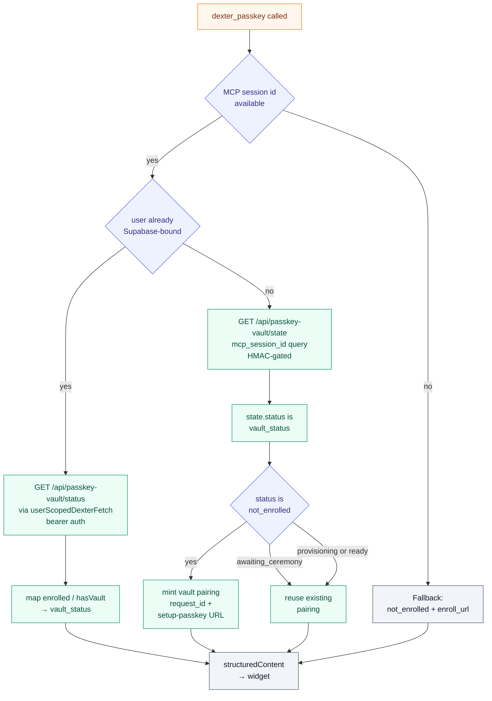

<p align="center">
  
</p>

<p align="center">
  <a href="https://nodejs.org/en/download">= 20"></a>
  <a href="https://mcp.dexter.cash/mcp"></a>
  <a href="https://dexter.cash"></a>
</p>

<p align="center">
  <a href="https://github.com/BranchManager69/dexter-api">Dexter API</a>
  · <a href="https://github.com/BranchManager69/dexter-fe">Dexter FE</a>
  · <strong>Dexter MCP</strong>
  · <a href="https://github.com/BranchManager69/dexter-ops">Dexter Ops</a>
  · <a href="https://github.com/BranchManager69/pumpstreams">PumpStreams</a>
</p>

This repo contains two hosted MCP servers and the shared `@dexterai/x402-core` package:

| Product | Endpoint | Auth | Payment |
|---------|----------|------|---------|
| **Dexter MCP** (authenticated) | `mcp.dexter.cash/mcp` | Dexter OAuth | Managed wallet, automatic |
| **OpenDexter MCP** (public) | `open.dexter.cash/mcp` | None | Session wallets, user-funded |

The npm packages (`@dexterai/opendexter`, `@dexterai/x402-discovery`) live in [Dexter-DAO/opendexter-ide](https://github.com/Dexter-DAO/opendexter-ide).

---

## OpenDexter — Public x402 Gateway

OpenDexter is the public, no-auth MCP server for searching and paying x402 APIs. It powers the "OpenDexter" connector on ChatGPT and Claude.

**How sessions work:** When a user connects, `x402_wallet` creates a session with two addresses — one Solana, one EVM (shared across Base, Polygon, Arbitrum, Optimism, Avalanche). The user sends USDC to either or both. When `x402_fetch` is called, the system checks all chain balances and picks the best-funded chain that the endpoint accepts. Sessions persist for 30 days in PostgreSQL.

**How the npm package differs:** `@dexterai/opendexter` runs as a local stdio MCP server. Instead of ephemeral session wallets, it uses a local signer at `~/.dexterai-mcp/wallet.json`. The user funds their own wallet once and it persists indefinitely. It ships the buyer tools (`x402_search`, `x402_check`, `x402_fetch`, `x402_pay`, `x402_access`, `x402_wallet`) and a seller-side CLI command — `opendexter audition <url>` gets an x402 API into the catalog (a real paid test on every route, a quality score, a synthesized agent-callable Skill). `@dexterai/x402-discovery` is a published descriptive alias of the same package.

OpenDexter remains the product brand. `@dexterai/opendexter` is the canonical install name; `@dexterai/x402-discovery` is the descriptive alias for developers who search by capability.

| | OpenDexter MCP | @dexterai/opendexter npm |
|---|---|---|
| Transport | HTTPS (SSE) | stdio |
| Wallet | Ephemeral session (Solana + EVM) | Local signer file |
| Funding | User sends USDC to session addresses | User funds local wallet |
| Session lifetime | 30 days | Indefinite |
| Multi-chain | Yes (6 chains, auto-select) | Solana (local key) |
| Seller onboarding | — | `opendexter audition <url>` |
| Best for | ChatGPT, Claude, web agents | Cursor, Codex, CLI agents |

Source: `open-mcp-server.mjs` (hosted server). npm package source is in [opendexter-ide/packages/mcp](https://github.com/Dexter-DAO/opendexter-ide/tree/main/packages/mcp).

---

## Dexter MCP — Authenticated Platform

Fully managed MCP bridge for Dexter. By default it can expose the broader Dexter platform surface over OAuth-authenticated HTTPS, reusing the Dexter wallet infrastructure for automatic payment.

For OpenDexter launch mode, set:

```bash
TOKEN_AI_MCP_PROFILE=opendexter
```

That narrows the authenticated server to the clean `x402-client` bundle so the public story stays focused on search, discovery, pricing, wallet context, and x402 payment execution.

---

## Highlights

- **Production-ready HTTP transport** – OAuth2/OIDC, bearer fallback, SSE streaming, and metadata endpoints compatible with Claude & ChatGPT connectors.
- **Wallet-first toolset** – `resolve_wallet`, `list_my_wallets`, `auth_info`, `set_session_wallet_override`, plus per-session overrides backed by Supabase.
- **Composable tool registry** – drop new bundles into `toolsets/`, enable them via env, CLI flags, or `?tools=` query parameters.
- **Dual-runtime** – stdio entrypoint for local agents & Codex, HTTPS entrypoint for public connectors (proxied at `https://dexter.cash/mcp` and `https://mcp.dexter.cash/mcp`).
- **Supabase-native auth** – validates incoming tokens through Dexter API/Supabase resolver, injects identity headers for downstream tools, and preserves token caching to limit IdP calls.

---

## `dexter_passkey` — the OTS buyer-onboarding widget

`dexter_passkey` is the agent-facing onboarding for the [Open Tabs Standard](https://github.com/Dexter-DAO/dexter-vault) buyer wallet. When called, it returns an embedded React widget (in `apps-sdk/ui/src/entries/passkey-onboard.tsx`) that renders one of four durable states resolved from `dexter-api`:

| State | What the widget shows |
|---|---|
| `not_enrolled` | "Set up your wallet" CTA → opens dexter.cash/wallet/setup-passkey in a new top-level tab (the chat-iframe sandbox blocks WebAuthn) |
| `awaiting_ceremony` | "Finish in the other tab" — the user started enrollment but hasn't completed the passkey ceremony; widget polls until it flips |
| `provisioning` | "Setting up your wallet" — vault is being created on Solana |
| `ready` | "Your wallet's ready" — shows the swig address with copy + "Manage your wallet" + "View on Solscan" |

State is resolved via `GET /api/passkey-vault/state?mcp_session_id=…` (HMAC-gated, durable — reads the `passkey_vault_pairings` table directly so it survives MCP process restarts). The widget polls every 1.5s while `awaiting_ceremony` and consumes the poll's return value to update itself, rather than relying on host tool-result notifications that don't fire for widget-initiated calls.

Both MCP servers register the tool (`open-mcp-server.mjs` for the public OpenDexter server, the authenticated tree for `dexter-mcp`). The shared helper that calls `/state` lives in [`lib/pairing-mint.mjs`](./lib/pairing-mint.mjs).

### Widget state machine

The widget mounts in whatever state `dexter-api` says, polls every 1.5s while a passkey ceremony is open in another tab, and consumes its own poll's return value to flip. Without that the host never delivers the update for a widget-initiated call.



`awaiting_ceremony` is a flag on `not_enrolled` (not a separate top-level status), but it's what drives the "Finish in the other tab" copy and the auto-polling. The widget mints a fresh pairing URL only on the *first* entry into `not_enrolled`. Minting on every poll was the forever-poll bug.

### Tool flow

`dexter_passkey` branches on what the MCP session already knows about the caller:



Branch 1 is for legacy Supabase-paired sessions and still uses the bearer-auth `/status` route. Branch 2 is the durable path used by every new guest-track caller — the same path the `dexter_passkey_probe` tool exercises during onboarding diagnostics. Branch 3 is the fallback for a session without an id.

---

## Access Tiers

| Label | Who can call | Notes | Examples |
|-------|--------------|-------|----------|
| `guest` | Shared demo bearer (`TOKEN_AI_MCP_TOKEN`), no login required | Read-only research and wallet discovery; no trade execution. | `general/search`, `pumpstream_live_summary`, `markets_fetch_ohlcv`, `wallet/resolve_wallet` |
| `member` | Authenticated Supabase session / `dexter_mcp_jwt` | Unlocks personal wallet context and member-only helpers. | `wallet/list_my_wallets`, `wallet/set_session_wallet_override`, `stream_public_shout` |
| `pro` | Role-gated (Pro or Super Admin) | Supabase role check gates paid trading surfaces. | `hyperliquid_markets`, `hyperliquid_perp_trade` |
| `dev` | Super Admins only | Protected experimental surfaces. | `codex_start`, `codex_exec` |
| `internal` | Diagnostic tooling | Not exposed to end users. | `wallet/auth_info` |

Guest and member tiers align with the public marketing funnel: every new Dexter account now ships with a managed wallet, so resolver-backed tools should immediately report `source:"resolver"`; the legacy env fallback (`TOKEN_AI_DEFAULT_WALLET_ADDRESS`) remains for guest-only scenarios.

---

## Dexter Stack

| Repo | Role |
|------|------|
| [`dexter-api`](https://github.com/BranchManager69/dexter-api) | Issues realtime tokens, proxies MCP, x402 billing |
| [`dexter-fe`](https://github.com/BranchManager69/dexter-fe) | Next.js frontend for voice/chat surfaces |
| [`dexter-ops`](https://github.com/BranchManager69/dexter-ops) | Shared operations scripts, PM2 config, nginx templates |
| [`pumpstreams`](https://github.com/BranchManager69/pumpstreams) | Pump.fun analytics suite (adjacent tooling) |

---

## Quick Start

```bash
git clone https://github.com/BranchManager69/dexter-mcp.git
cd dexter-mcp
npm install
cp .env.example .env

# populate .env with required Supabase/OAuth settings

# HTTPS transport (port 3930)
npm start

# or stdio transport for local tools
node server.mjs --tools=wallet
```

Verify the HTTP transport:

```bash
curl -sS http://localhost:3930/mcp/health | jq
```

With the public proxy in place you can also query:

```bash
curl -H "Authorization: Bearer <TOKEN_AI_MCP_TOKEN>" \
     https://mcp.dexter.cash/mcp/health
```

---

## Authentication

| Mode | When to use | How |
|------|-------------|-----|
| **OAuth2 / OIDC** | Claude, ChatGPT, hosted connectors | Set `TOKEN_AI_MCP_OAUTH=true` and supply `TOKEN_AI_OIDC_*` (or Supabase) endpoints. Users sign in via the Dexter IdP; tokens are validated on every session. |
| **Bearer token** | Service-to-service calls, Codex, Cursor | Define `TOKEN_AI_MCP_TOKEN`. Any request presenting the matching `Authorization: Bearer …` header is accepted without hitting the IdP. |
| **Allow-any (demo)** | Local demos only | Set `TOKEN_AI_MCP_OAUTH_ALLOW_ANY=1`. Skips verification—**never enable in production**. |

Metadata endpoints (for connector discovery) are exposed at:

- `/.well-known/oauth-authorization-server`
- `/.well-known/oauth-protected-resource`
- `/.well-known/openid-configuration`

These routes are proxied on both `dexter.cash` and `mcp.dexter.cash`, so connectors can follow the same issuer regardless of which hostname they use.

---

## Toolsets

Tool bundles live under `toolsets/<name>/index.mjs` and register themselves through the manifest in `toolsets/index.mjs`.

Currently shipped:

- **general** – Tavily-backed web `search` with `max_results`, depth, and answer summaries plus a `fetch` helper that returns full-page content (snippets, metadata, raw HTML) for realtime research.
- **pumpstream** – `pumpstream_live_summary` view of `https://pump.dexter.cash/api/live`, supporting `pageSize`/`offset`/`page`, search, symbol & mint filters, sort order, status gates, viewer and USD market-cap floors, and optional spotlight data.
- **wallet** – Session-aware helpers (`resolve_wallet`, `list_my_wallets`, `set_session_wallet_override`, `auth_info`) backed by the Supabase resolver with per-session overrides stored in-memory.
- **solana** – Managed Solana trading utilities (`solana_resolve_token`, balance listings, swap preview/execute) proxied through `dexter-api` with entitlement checks.
- **markets** – `markets_fetch_ohlcv` pipes Birdeye v3 pair data, auto-selecting the top-liquidity pair when only a mint is supplied to power price history charts.
- **codex** – Bridges MCP clients to the Codex CLI via `codex_start`, `codex_reply`, and `codex_exec`, supporting optional JSON schemas for structured exec-mode responses.
- **stream** – DexterVision shout utilities only (`stream_public_shout`, `stream_shout_feed`) so concierge sessions can create/read overlay shouts without touching scene state.
- **onchain** – `onchain_activity_overview` and `onchain_entity_insight` surface wallet/token analytics from dexter-api with Supabase auth passthrough.
- **x402** – Auto-registered paid resources from dexter-api (slippage sentinel, Jupiter quote preview, Twitter topic analysis, Solscan trending, Sora video jobs, meme jobs, GMGN snapshot access, etc.). The bundle updates itself whenever `/api/x402/resources` changes.
- **hyperliquid** – `hyperliquid_markets`, `hyperliquid_opt_in`, and `hyperliquid_perp_trade` expose Hyperliquid copy-trading helpers.

Each tool definition exposes an `_meta` block so downstream clients can group or gate consistently:

```json
{
  "name": "solana_swap_execute",
  "title": "Execute Solana Swap",
  "description": "Execute a SOL-token swap after previewing the expected output.",
  "_meta": {
    "category": "solana.trading",
    "access": "member",
    "tags": ["swap", "execution"]
  }
}
```

- `category` – high-level grouping for UX (e.g. `wallets`, `analytics`, `solana.trading`).
- `access` – current entitlement level (`guest`, `member`, `pro`, `dev`, `internal`).
- `tags` – free-form labels for filtering/badging.

The `/tools` API simply relays this metadata so UIs (including `dexter-fe`) pick it up automatically. Add new values conservatively and document them if third-party clients depend on them.

Selection options:

- **Environment default:** leave `TOKEN_AI_MCP_TOOLSETS` unset to load every registered bundle (general, pumpstream, wallet, solana, markets, stream, codex, onchain, x402, hyperliquid). Set it (comma-separated) to restrict the selection, e.g. `TOKEN_AI_MCP_TOOLSETS=wallet`.
- **Launch profile shortcut:** set `TOKEN_AI_MCP_PROFILE=opendexter` to load only the x402 discovery/payment surface on the authenticated server.
- **CLI/stdio:** `node server.mjs --tools=wallet`.
- **CLI/stdio profile:** `node server.mjs --profile=opendexter`.
- **HTTP query:** `POST /mcp?tools=wallet` or `POST /mcp?profile=opendexter`.
- **Codex:** set `TOKEN_AI_MCP_TOOLSETS` in the env before launching, or add `includeToolsets` when invoking `buildMcpServer` manually.

Public-facing descriptions and metadata belong in the MCP specs; reserve deep orchestration notes, guardrails, and internal guidance for the realtime agent prompts/configs so clients only see the high-level contract.

Legacy Token-AI bundles remain in `legacy-tools/` for reference. They are not registered by default but can be migrated into `toolsets/` as they are modernized.

---

## Development & PM2

Run locally:

```bash
# HTTP transport with auto-reload (e.g. via nodemon)
TOKEN_AI_MCP_PORT=3930 npm start

# Stdio session for quick manual tests
node server.mjs --tools=wallet

# Connect with Codex (bearer token example)
# ~/.codex/config.toml
# [mcp_servers.dexter]
# transport = "http"
# url = "https://mcp.dexter.cash/mcp"
# headers = { Authorization = "Bearer <TOKEN_AI_MCP_TOKEN>" }
```

### Harness Operations

The Playwright harness lives in `../dexter-agents/scripts/runHarness.js` with CLI entry `scripts/dexchat.js` (npm script `dexchat`). Append `--guest` to skip stored auth and exercise the anonymous path; the API leg still rides on the shared demo bearer (`TOKEN_AI_MCP_TOKEN`).

Core commands:

```bash
# Standard run (UI + API with 15s wait)
npm run dexchat -- --prompt "<prompt>" --wait 15000

# Pumpstream harness from this repo (UI + API)
npm run test:pumpstream -- --mode both --prompt "List pump streams"

# Targeted API-only regression run
npm run test:pumpstream -- --mode api --page-size 10 --json --no-artifact
```

Pass harness flags (`--prompt`, `--url`, `--wait`, `--headful`, `--no-artifact`, `--json`, `--mode`, `--page-size`) directly; they forward to the underlying runners. `.env` is auto-loaded so long-lived values such as `HARNESS_COOKIE`, `HARNESS_AUTHORIZATION`, and `HARNESS_MCP_TOKEN` can live there instead of the shell. Artifacts land in `dexter-agents/harness-results/` unless you opt into `--no-artifact`.

Monitor the console for schema warnings (for example, Zod `.optional()` used without `.nullable()`). Treat any warning as a regression that must be cleared before release. Harness artifacts are the source of truth for recent behavioural checks—house longer-form analysis elsewhere so this document stays operational.

For production, PM2 is managed through `dexter-ops/ops/ecosystem.config.cjs`. The config already forwards `TOKEN_AI_MCP_OAUTH=true` and supporting variables; restart via:

```bash
pm2 restart dexter-mcp
pm2 logs dexter-mcp
```

### Session Maintenance Cheatsheet

```
Turnstile + Supabase login (desktop helper)
           │  generates encoded cookie + state.json
           ▼
HARNESS_COOKIE in repos (.env)
           │  injected into Playwright runs
           ▼
Dexchat / pumpstream harness executions
```

| Situation | Run this | Result |
|-----------|----------|--------|
| Have a new encoded cookie string | `dexchat refresh` (in `dexter-agents`) | Updates both repos’ `.env` files and rewrites `~/websites/dexter-mcp/state.json` through a local Playwright run. |
| Want a scripted variant | `npm run dexchat:refresh -- --cookie $(cat cookie.txt)` | Same as above without the interactive prompt. |
| Supabase session has expired / cookie immediately fails | `refresh-supabase-session.ps1` (desktop helper) | Spins up SOCKS proxy + Chrome for Turnstile + Supabase login, prints the cookie, and can refresh storage automatically. Afterwards run `dexchat refresh` with the new value. |
| Validate guest behaviour | `npm run dexchat -- --prompt "..." --guest` (or add `--guest` to `npm run pumpstream:harness ...`) | Runs the UI anonymously while the API leg reuses the shared demo bearer (`TOKEN_AI_MCP_TOKEN`). |

Storage state only changes when the harness runs with `--storage` (the refresh helper toggles it automatically). If the cookie helper warns that the pasted value is missing `sb-…-refresh-token`, per-user MCP tokens cannot be minted—re-run the desktop helper to capture a full credential set.

Remember: the desktop helper is rare (weeks between runs). `dexchat refresh` is the lightweight, local option you’ll use most often. Additional command details live in `dexter-agents/scripts/README.md`.

---

## Architecture Notes

- **`common.mjs`** – builds the MCP server, normalizes Zod schemas, wraps tool registration with logging.
- **`toolsets/`** – declarative manifest of tool bundles plus the wallet toolset implementation.
- **Toolset authoring guide:** see `toolsets/ADDING_TOOLSETS.md` for step-by-step instructions and examples (including the `pumpstream` toolset).
- **`server.mjs`** – stdio entrypoint (used by local agents and Codex); respects `--tools=` flags.
- **`dexter-mcp-stdio-bridge.mjs`** – bridges stdio clients to the hosted OAuth HTTP transport (handy for Codex/Cursor when they only support stdio).
- **`http-server-oauth.mjs`** – HTTPS transport with OAuth/OIDC, session caching, and metadata routes (still contains a Prisma-backed fallback to seed per-session wallet overrides).
- **`legacy-tools/`** – archived Token-AI tools kept for reference during migration.

Supabase interactions flow through Dexter API helpers for consistent auth enforcement. The only remaining Prisma access is the wallet-override seeding noted above; retire it when the resolver exposes a "default wallet" flag.

---

## Related Repositories

- [dexter-api](../dexter-api) – OAuth issuer, wallet resolver, and connector orchestration.
- [dexter-fe](../dexter-fe) – Web frontend (Claude/ChatGPT connector auth, realtime demos).
- [pumpstreams](../pumpstreams) – Monitoring suite that inspired this README structure.

---

## License

Private – internal Dexter connector infrastructure.
