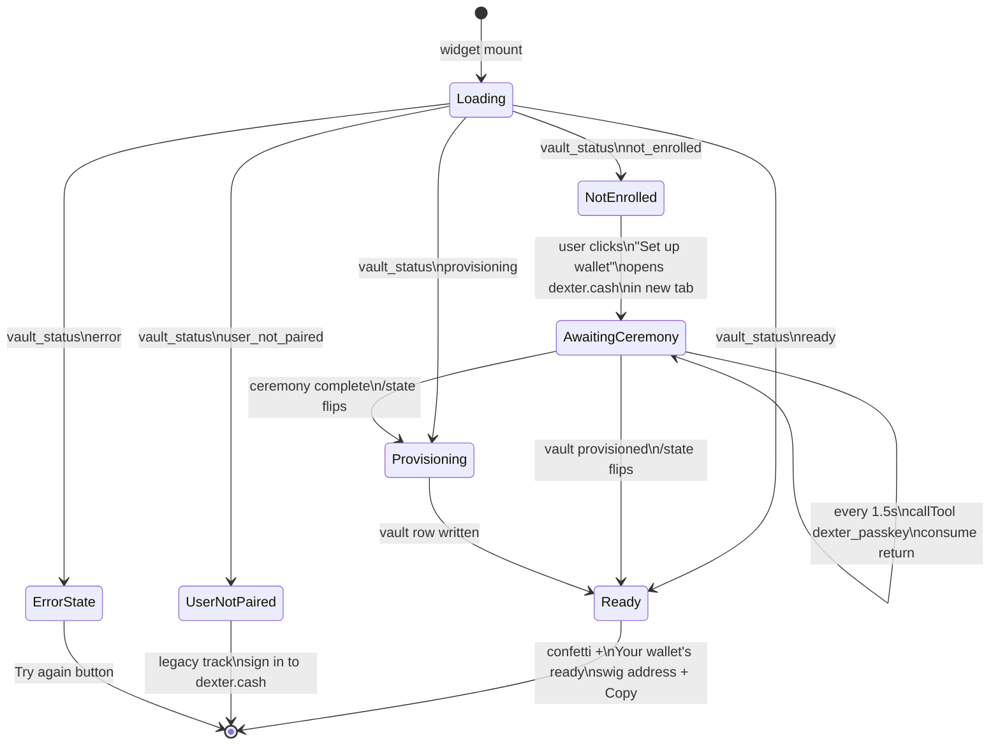
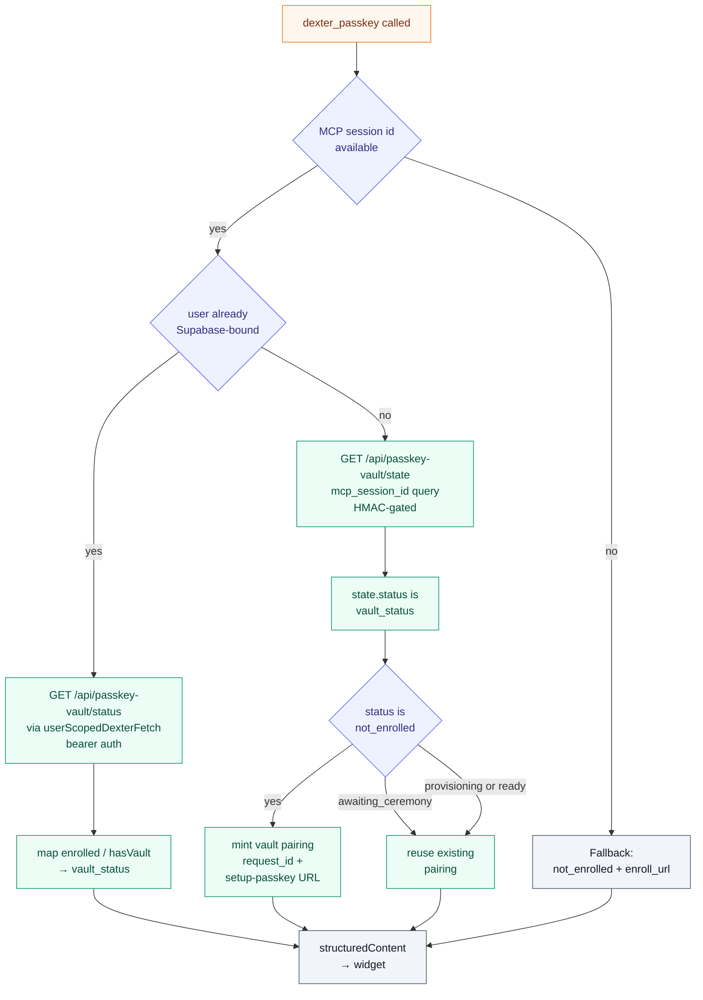

<p align="center">
  
</p>

<p align="center">
  <a href="https://nodejs.org/en/download">= 20"></a>
  <a href="https://mcp.dexter.cash/mcp"></a>
  <a href="https://dexter.cash"></a>
</p>

<p align="center">
  <a href="https://github.com/Dexter-DAO/dexter-api">Dexter API</a>
  · <a href="https://github.com/Dexter-DAO/dexter-fe">Dexter FE</a>
  · <strong>Dexter MCP</strong>
  · <a href="https://github.com/Dexter-DAO/dexter-vault">Dexter Vault</a>
  · <a href="https://github.com/Dexter-DAO/dexter-facilitator">Dexter Facilitator</a>
</p>

This repo contains two hosted MCP servers and the shared `@dexterai/x402-core` package:

| Product | Endpoint | Auth | Payment |
|---------|----------|------|---------|
| **Dexter MCP** (authenticated) | `mcp.dexter.cash/mcp` | Dexter OAuth | Managed wallet, automatic |
| **OpenDexter MCP** (public) | `open.dexter.cash/mcp` | None | Session wallets, user-funded |

The npm packages (`@dexterai/opendexter`, `@dexterai/x402-discovery`) live in [Dexter-DAO/opendexter-ide](https://github.com/Dexter-DAO/opendexter-ide).

---

## OpenDexter: the public x402 gateway

OpenDexter is the public, no-auth MCP server for searching and paying x402 APIs. It powers the "OpenDexter" connector on ChatGPT and Claude.

**How sessions work.** When a user connects, `x402_wallet` creates a session with two addresses, one Solana and one EVM (shared across Base, Polygon, Arbitrum, Optimism, Avalanche). The user sends USDC to either or both. When `x402_fetch` is called, the system checks all chain balances and picks the best-funded chain that the endpoint accepts. Sessions persist for 30 days in PostgreSQL.

**How the npm package differs.** `@dexterai/opendexter` runs as a local stdio MCP server. Instead of ephemeral session wallets, it uses a local signer at `~/.dexterai-mcp/wallet.json`. The user funds their own wallet once and it persists indefinitely. It ships the buyer tools (`x402_search`, `x402_check`, `x402_fetch`, `x402_pay`, `x402_access`, `x402_wallet`) and a seller-side CLI command: `opendexter audition <url>` gets an x402 API into the catalog (a real paid test on every route, a quality score, a synthesized agent-callable Skill). `@dexterai/x402-discovery` is a published alias of the same package.

| | OpenDexter MCP | @dexterai/opendexter npm |
|---|---|---|
| Transport | HTTPS (SSE) | stdio |
| Wallet | Ephemeral session (Solana + EVM) | Local signer file |
| Funding | User sends USDC to session addresses | User funds local wallet |
| Session lifetime | 30 days | Indefinite |
| Multi-chain | Yes (6 chains, auto-select) | Solana (local key) |
| Seller onboarding | `opendexter audition <url>` |
| Best for | ChatGPT, Claude, web agents | Cursor, Codex, CLI agents |

Source: `open-mcp-server.mjs` (hosted server). npm package source is in [opendexter-ide/packages/mcp](https://github.com/Dexter-DAO/opendexter-ide/tree/main/packages/mcp).

---

## Dexter MCP: the authenticated server

The authenticated server at `mcp.dexter.cash/mcp` exposes the broader Dexter platform surface over OAuth-authenticated HTTPS, reusing the managed Dexter wallet infrastructure for automatic payment. It's what the Dexter brand connector on Claude and ChatGPT talks to.

Source: `http-server-oauth.mjs`.

---

## `dexter_passkey`: the OTS buyer-onboarding widget

`dexter_passkey` is the agent-facing onboarding for the [Open Tabs Standard](https://github.com/Dexter-DAO/dexter-vault) buyer wallet. When called, it returns an embedded React widget (in `apps-sdk/ui/src/entries/passkey-onboard.tsx`) that renders one of four durable states resolved from `dexter-api`:

| State | What the widget shows |
|---|---|
| `not_enrolled` | "Set up your wallet" CTA, opens dexter.cash/wallet/setup-passkey in a new top-level tab (the chat-iframe sandbox blocks WebAuthn) |
| `awaiting_ceremony` | "Finish in the other tab", the user started enrollment but hasn't completed the passkey ceremony; widget polls until it flips |
| `provisioning` | "Setting up your wallet", vault is being created on Solana |
| `ready` | "Your wallet's ready", shows the swig address with copy + "Manage your wallet" + "View on Solscan" |

State is resolved via `GET /api/passkey-vault/state?mcp_session_id=…`, HMAC-gated and durable: it reads the `passkey_vault_pairings` table directly so it survives MCP process restarts. The widget polls every 1.5s while `awaiting_ceremony` and consumes the poll's return value to update itself, rather than relying on host tool-result notifications that don't fire for widget-initiated calls.

Both MCP servers register the tool (`open-mcp-server.mjs` for the public OpenDexter server, the authenticated tree for `dexter-mcp`). The shared helper that calls `/state` lives in [`lib/pairing-mint.mjs`](./lib/pairing-mint.mjs).

### Widget state machine

The widget mounts in whatever state `dexter-api` says, polls every 1.5s while a passkey ceremony is open in another tab, and consumes its own poll's return value to flip. Without that the host never delivers the update for a widget-initiated call.



`awaiting_ceremony` is a flag on `not_enrolled` (not a separate top-level status), but it's what drives the "Finish in the other tab" copy and the auto-polling. The widget mints a fresh pairing URL only on the *first* entry into `not_enrolled`. Minting on every poll was the forever-poll bug.

### Tool flow

`dexter_passkey` branches on what the MCP session already knows about the caller:



Branch 1 is for legacy Supabase-paired sessions and still uses the bearer-auth `/status` route. Branch 2 is the durable path used by every new guest-track caller, the same path the `dexter_passkey_probe` tool exercises during onboarding diagnostics. Branch 3 is the fallback for a session without an id.

---

## Access Tiers

| Label | Who can call | Examples |
|-------|--------------|----------|
| `guest` | Shared demo bearer, no login required | `general/search`, `wallet/resolve_wallet` |
| `member` | Authenticated Supabase session / `dexter_mcp_jwt` | `wallet/list_my_wallets`, `wallet/set_session_wallet_override` |
| `pro` | Role-gated (Pro or Super Admin) | `hyperliquid_markets`, `hyperliquid_perp_trade` |
| `dev` | Super Admins only | `codex_start`, `codex_exec` |
| `internal` | Diagnostic tooling, not exposed to end users | `wallet/auth_info` |

Every new Dexter account ships with a managed wallet, so resolver-backed tools immediately report `source:"resolver"`.

---

## Quick Start

```bash
git clone https://github.com/Dexter-DAO/dexter-mcp.git
cd dexter-mcp
npm install
cp .env.example .env

# populate .env with required Supabase/OAuth settings

# HTTPS transport (port 3930)
npm start

# or stdio transport for local tools
node server.mjs --tools=wallet
```

Verify the HTTP transport:

```bash
curl -sS http://localhost:3930/mcp/health | jq
```

With the public proxy in place:

```bash
curl -H "Authorization: Bearer <TOKEN_AI_MCP_TOKEN>" \
     https://mcp.dexter.cash/mcp/health
```

---

## Authentication

| Mode | When to use | How |
|------|-------------|-----|
| **OAuth2 / OIDC** | Claude, ChatGPT, hosted connectors | Set `TOKEN_AI_MCP_OAUTH=true` and supply `TOKEN_AI_OIDC_*` (or Supabase) endpoints. Users sign in via the Dexter IdP; tokens are validated on every session. |
| **Bearer token** | Service-to-service calls, Codex, Cursor | Define `TOKEN_AI_MCP_TOKEN`. Any request presenting the matching `Authorization: Bearer …` header is accepted without hitting the IdP. |
| **Allow-any (demo)** | Local demos only | Set `TOKEN_AI_MCP_OAUTH_ALLOW_ANY=1`. Skips verification. **Never enable in production.** |

Metadata endpoints (for connector discovery):

- `/.well-known/oauth-authorization-server`
- `/.well-known/oauth-protected-resource`
- `/.well-known/openid-configuration`

These routes are proxied on both `dexter.cash` and `mcp.dexter.cash`, so connectors can follow the same issuer regardless of which hostname they use.

---

## Toolsets

Tool bundles live under `toolsets/<name>/index.mjs` and register themselves through the manifest in `toolsets/index.mjs`. Bundles currently shipped:

| Bundle | What it does |
|---|---|
| `x402` | Auto-registered paid resources from dexter-api (slippage sentinel, Jupiter quote, Twitter topic analysis, Solscan trending, Sora/meme jobs, GMGN snapshot, etc). Updates itself whenever `/api/x402/resources` changes. |
| `wallet` | Session-aware helpers (`resolve_wallet`, `list_my_wallets`, `set_session_wallet_override`, `auth_info`) backed by the Supabase resolver. |
| `solana` | Managed Solana trading utilities (`solana_resolve_token`, balance listings, swap preview/execute) proxied through `dexter-api` with entitlement checks. |
| `markets` | `markets_fetch_ohlcv` over Birdeye v3 pair data, auto-selecting the top-liquidity pair when only a mint is supplied. |
| `onchain` | `onchain_activity_overview` and `onchain_entity_insight` for wallet/token analytics. |
| `general` | Tavily-backed web `search` with depth + answer summaries plus a `fetch` helper for realtime research. |
| `hyperliquid` | `hyperliquid_markets`, `hyperliquid_opt_in`, `hyperliquid_perp_trade` for Hyperliquid copy-trading. |
| `codex` | Bridges MCP clients to the Codex CLI via `codex_start`, `codex_reply`, `codex_exec`. |
| `pumpstream` | `pumpstream_live_summary` view of `https://pump.dexter.cash/api/live` with filters, sort, viewer/USD floors. |
| `stream` | DexterVision shout utilities (`stream_public_shout`, `stream_shout_feed`). |

Each tool exposes an `_meta` block so downstream clients can group or gate consistently:

```json
{
  "name": "solana_swap_execute",
  "title": "Execute Solana Swap",
  "_meta": {
    "category": "solana.trading",
    "access": "member",
    "tags": ["swap", "execution"]
  }
}
```

- `category`: high-level grouping for UX (e.g. `wallets`, `analytics`, `solana.trading`)
- `access`: entitlement level (`guest`, `member`, `pro`, `dev`, `internal`)
- `tags`: free-form labels for filtering/badging

Selection options:

| Where | How |
|---|---|
| Environment default | Leave `TOKEN_AI_MCP_TOOLSETS` unset to load every bundle. Set it (comma-separated) to restrict, e.g. `TOKEN_AI_MCP_TOOLSETS=wallet`. |
| Launch profile shortcut | `TOKEN_AI_MCP_PROFILE=opendexter` loads only the x402 surface on the authenticated server. |
| CLI / stdio | `node server.mjs --tools=wallet` or `--profile=opendexter`. |
| HTTP query | `POST /mcp?tools=wallet` or `POST /mcp?profile=opendexter`. |

Legacy Token-AI bundles in `legacy-tools/` remain for reference; they are not registered by default.

---

## Architecture Notes

- `common.mjs`: builds the MCP server, normalizes Zod schemas, wraps tool registration with logging.
- `toolsets/`: declarative manifest of tool bundles plus the wallet toolset implementation. Authoring guide at `toolsets/ADDING_TOOLSETS.md`.
- `server.mjs`: stdio entrypoint (used by local agents and Codex); respects `--tools=` flags.
- `dexter-mcp-stdio-bridge.mjs`: bridges stdio clients to the hosted OAuth HTTP transport (for Codex/Cursor when they only support stdio).
- `http-server-oauth.mjs`: HTTPS transport with OAuth/OIDC, session caching, metadata routes.
- `legacy-tools/`: archived Token-AI tools kept for reference during migration.

Supabase interactions flow through Dexter API helpers for consistent auth enforcement.

---

## Development

For local dev, PM2, harness operations, and Supabase session maintenance, see [`docs/dev/HARNESS.md`](./docs/dev/HARNESS.md).

---

## Dexter Stack

| Repo | Role |
|------|------|
| [`dexter-api`](https://github.com/Dexter-DAO/dexter-api) | OAuth issuer, wallet resolver, OTS buyer-side implementation, x402 billing |
| [`dexter-fe`](https://github.com/Dexter-DAO/dexter-fe) | Web frontend (Claude/ChatGPT connector auth, /wallet dashboard, admin) |
| [`dexter-vault`](https://github.com/Dexter-DAO/dexter-vault) | Open Tabs Standard reference implementation (Anchor program on Solana) |
| [`dexter-facilitator`](https://github.com/Dexter-DAO/dexter-facilitator) | x402 v2 payment facilitator (Solana + EVM) |

---

## License

All rights reserved. This source is public for transparency and reference, not for reuse. You may not copy, modify, redistribute, or use this code in your own projects without written permission from Dexter. The Dexter and OpenDexter names and marks are not licensed for any use.

For licensing inquiries: branch@dexter.cash.
